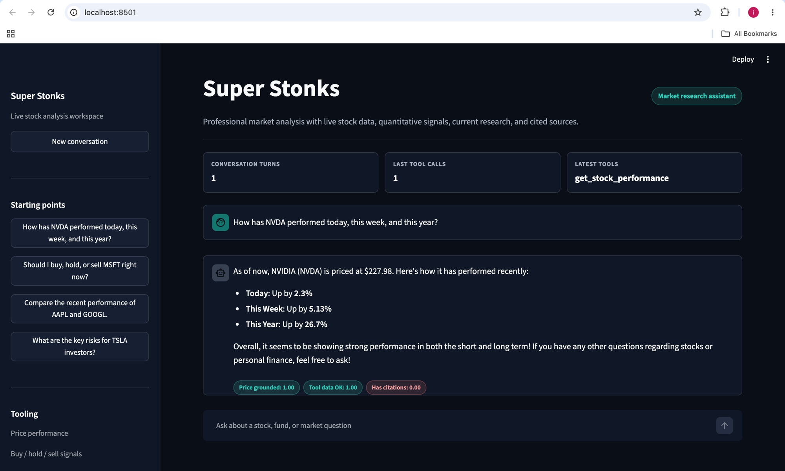

# Live evaluation score badges — Super Stonks

## Problem background

Super Stonks is a Braintrust workshop agent: a LangGraph stock-chat assistant,
instrumented with the Braintrust SDK, that answers questions like "How has NVDA
performed today, this week, and this year?" Every conversation is already traced
to Braintrust (`stonks-sessions` → `turn_{n}` spans), and the workshop ships a
set of deterministic scorers (`src/super_stonks/evals/scorers.py`,
`price_grounding.py`) that grade those traces — for example, whether the
agent's final answer actually states the price its price tool returned
(`price_response_matches_tool_data`), whether a tool call returned real data
instead of an error (`tool_returned_data`), and whether the reply includes a
`Citations:` section (`has_citations_header`).

The gap: those scorers only ever ran **after the fact** — offline, via
`bt eval` against a dataset, or as an async online scorer configured on the
Braintrust project (`push_assets.py` / `provision/configure.py`), which grades
spans on Braintrust's backend some time after they're logged. A person using
the Streamlit app (`src/super_stonks/app.py`) had no way to tell, in the
moment, whether the answer they just received was actually grounded in real
tool data — they'd have to go look at a trace or an experiment separately,
after the conversation was over.

This feature closes that gap: it scores every turn **instantly, in the same
request that produces it**, using the Braintrust SDK to log the scores onto
the turn's span, and renders the result as a small pass/fail badge directly
under the assistant's reply in the app.

## Design principles

1. **Single source of truth.** The live badges do not re-derive grading logic.
   They call the same scorer functions already used by the offline eval
   (`score_price_answer` from `evals/price_grounding.py`, `has_citations_header`
   from `evals/scorers.py`), so the number shown in the UI and the number a
   `bt eval` run produces can never silently drift apart.
2. **Instant over exhaustive.** Rather than poll Braintrust's async online
   scorer (which uses an LLM judge and can take seconds to minutes to
   complete), the badges are computed synchronously from data the app already
   has in hand — the LangGraph message list for that turn. This trades an
   LLM-judge score for a deterministic, sub-second one, which is the right
   trade for "show the user something right now."
3. **Log once, show twice.** Every computed score is written to the
   Braintrust span via `span.log(scores=...)` *and* rendered in the chat UI.
   The same measurement is visible live in the app and later in the
   Braintrust dashboard/trace view — there's one measurement, not two
   diverging ones.
4. **Don't hide the gap.** This repo's whole teaching point is a deliberately
   broken tool (`get_stock_performance` is commented out by default — see
   `docs/GAP.md`). If the price tool wasn't called on a given turn, the
   grounding score is still `0.0`. The badges are not designed to always look
   green; they're designed to make the failure visible the moment it happens.
5. **Minimal, additive change.** No new framework, no new abstraction layer —
   three small functions (`_parse_tool_results`, `_score_turn`,
   `_render_score_badges`) plus a few CSS rules, following the existing file's
   style, with nothing else in the app restructured.

## How it works (code walkthrough)

All of the following lives in `src/super_stonks/app.py`.

- **`_parse_tool_results(messages)`** — LangGraph stores a tool call and its
  result as two separate messages: an assistant message with a `tool_calls`
  list, and a following `role: tool` message keyed by `tool_call_id`. This
  function re-joins them into `{name, output}` pairs so the scorer can ask
  "what did tool X actually return this turn?" without needing a Braintrust
  trace object (the trace-based scorers in `evals/scorers.py` use
  `trace.get_spans(...)`, which isn't available synchronously mid-request).

- **`_score_turn(user_input, reply, new_messages)`** — computes three scores
  for the turn that just ran:
  - `price_response_matches_tool_data`: reuses `score_price_answer()` (the
    same function the offline eval in `qa_eval.py` uses) against the current
    turn's tool outputs.
  - `tool_returned_data`: a local re-implementation of
    `scorers.tool_returned_data`'s logic (has the price tool returned data
    without an `error` key?), reading from `_parse_tool_results` instead of an
    async trace fetch.
  - `has_citations_header`: called directly — it's already trace-independent
    in `evals/scorers.py`, just wrapped in `asyncio.run(...)` since it's
    defined as an `async def` (it does no I/O, so this is safe to call
    synchronously from Streamlit's request handling).

- **`_run_agent(...)`** calls `_score_turn(...)` right after producing the
  reply, logs the scores onto the turn's Braintrust span
  (`span.log(scores=..., metadata={"scores": scores, ...})`), and returns
  `(reply, scores)` back to the caller.

- **`_render_score_badges(scores)`** renders one colored pill per score —
  teal/"good" for `1.0`, red/"bad" for anything less — directly under the
  assistant's message, both for the turn that just ran and for prior turns
  redrawn from `display_messages` on rerun.

## What it looks like

A turn where the (normally disabled) price tool was live, showing all three
scores under the reply:

- **Price grounded: 1.00** — the reply's stated price matched the tool's
  `current_price`.
- **Tool data OK: 1.00** — the price tool returned real data, not an error.
- **Has citations: 0.00** — the reply had no `Citations:` section, so this
  one is (correctly) red.

## Where the scores land in Braintrust

Because `_run_agent` logs `scores={...}` on the turn span via the Braintrust
SDK, the same three numbers also show up on that span in the Braintrust
dashboard — this feature adds a live view in the app without changing where
the data ultimately lives, and without touching the trace shape
(`stonks-sessions` → `turn_{n}`) the rest of the workshop's tooling
(scorers, Topics, seed scripts) depends on.
